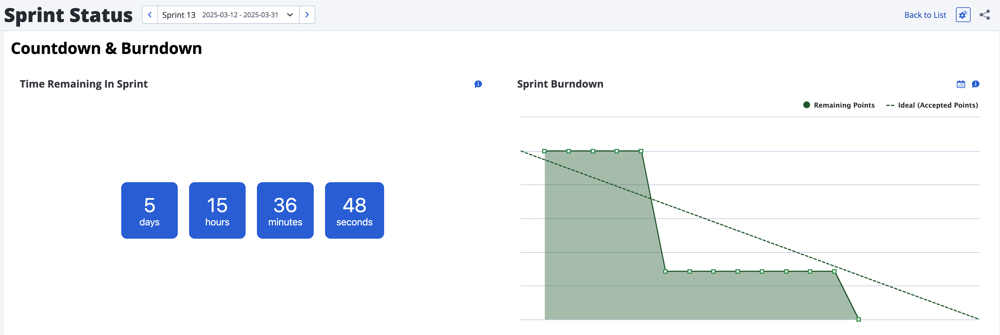

# Rally Countdown Widget

A Rally Widget for custom views showing a countdown timer towards a set date and time.

Note: This is the free version containing limited functionality. This version will count down to the end date of a selected Iteration, Release or Milestone view filter selected at the top of the custom view.

For more features, including the ability to change the style, color, format and target date, visit [RallyWidgets.com](https://rallywidgets.com)

## Installation

Open the `countdown_widget.txt` file, select all of the text and copy the contents to your clipboard. On the edit screen of a custom view, add a new `Custom HTML` widget. In the configuration window, delete the contents of the `HTML Source` text box then paste the copied code into this text box. Make any other necessary updates to the available settings and click `Save Configuration`.

Visit [RallyWidgets.com](https://rallywidgets.com) to reach out with questions.
